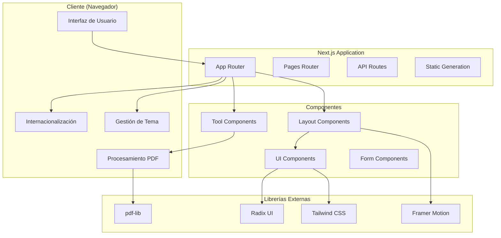
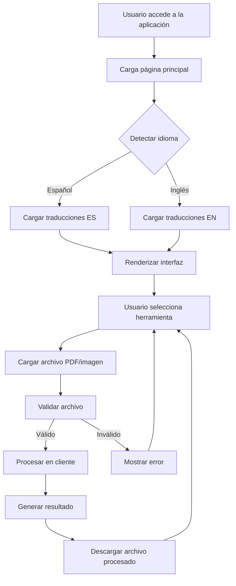
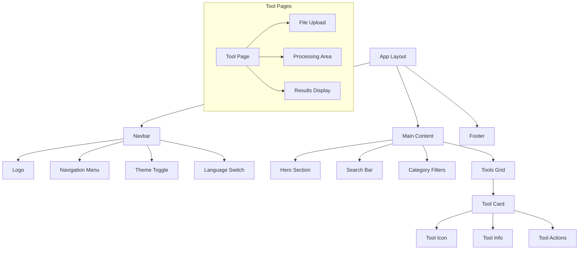
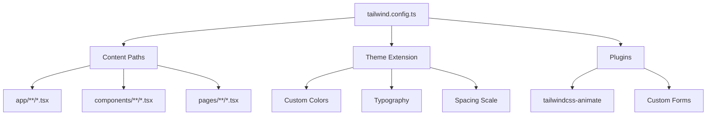
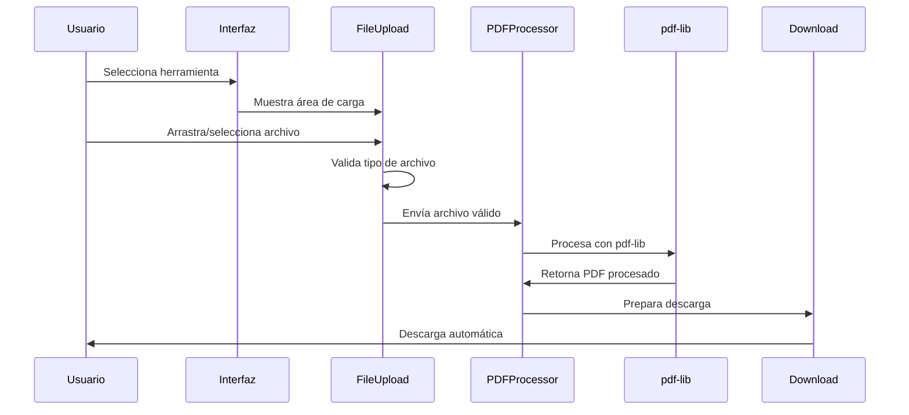
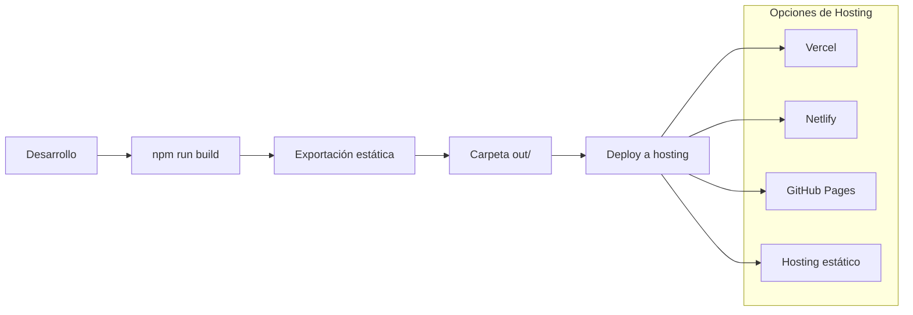
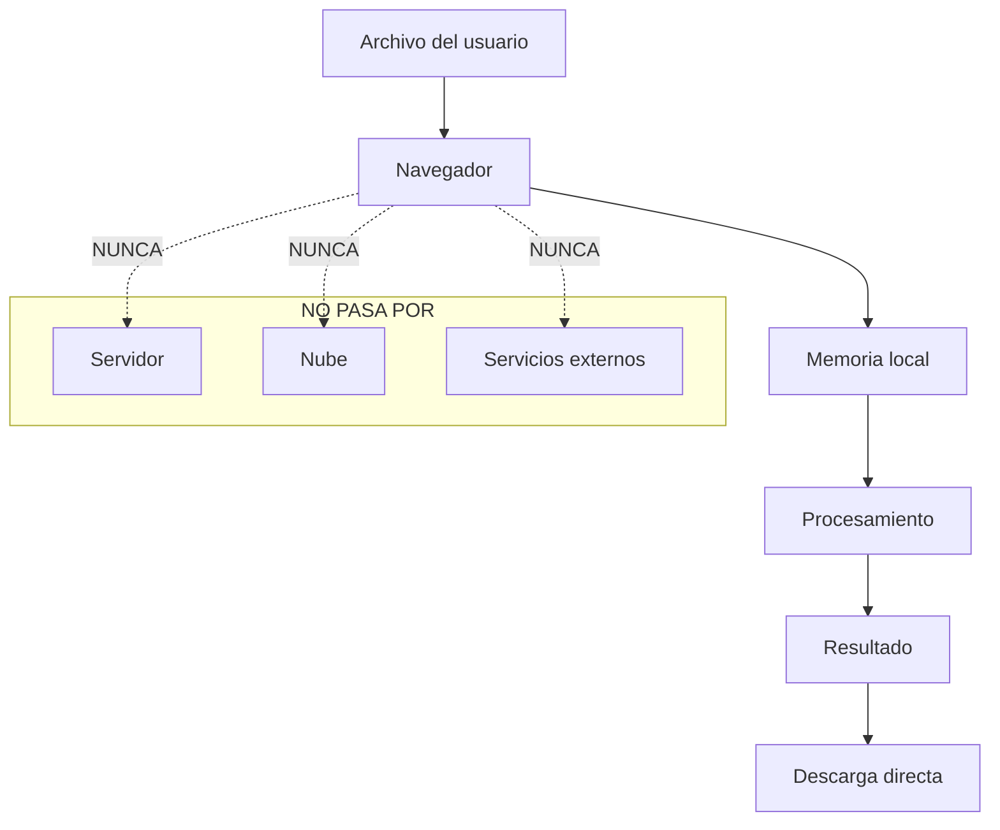

# Arquitectura del Proyecto SwiftPDF

## 🏗️ Visión General de la Arquitectura

SwiftPDF está construido como una aplicación web moderna utilizando Next.js 13 con App Router, implementando una arquitectura de procesamiento del lado del cliente para garantizar la privacidad y seguridad de los datos del usuario.

## 📊 Diagrama de Arquitectura General



## 🔄 Flujo de Datos de la Aplicación



## 🏛️ Arquitectura de Componentes

### Jerarquía de Componentes



### Componentes Principales

#### 1. Layout Components
- **[`Layout.tsx`](components/Layout.tsx)** - Wrapper principal de la aplicación
- **[`Navbar.tsx`](components/Navbar.tsx)** - Barra de navegación superior
- **[`Footer.tsx`](components/Footer.tsx)** - Pie de página

#### 2. Feature Components
- **[`ToolCard.tsx`](components/ToolCard.tsx)** - Tarjeta de herramienta individual
- **[`SearchBar.tsx`](components/SearchBar.tsx)** - Barra de búsqueda
- **[`CategoryFilter.tsx`](components/CategoryFilter.tsx)** - Filtros de categoría
- **[`FileUpload.tsx`](components/FileUpload.tsx)** - Componente de carga de archivos

#### 3. UI Components (Radix UI)
Ubicados en [`components/ui/`](components/ui/):
- **Button, Card, Dialog** - Componentes básicos de interfaz
- **Form, Input, Select** - Componentes de formulario
- **Toast, Alert** - Componentes de notificación

## 🗂️ Estructura de Directorios Detallada

```
swift_pdf/
├── 📁 app/                          # App Router (Next.js 13+)
│   ├── 📄 globals.css              # Estilos globales + Tailwind
│   ├── 📄 layout.tsx               # Layout raíz de la aplicación
│   └── 📄 page.tsx                 # Página principal (Home)
│
├── 📁 components/                   # Componentes React reutilizables
│   ├── 📁 ui/                      # Componentes UI base (Radix)
│   │   ├── 📄 button.tsx           # Componente Button
│   │   ├── 📄 card.tsx             # Componente Card
│   │   ├── 📄 dialog.tsx           # Componente Modal/Dialog
│   │   ├── 📄 form.tsx             # Componentes de formulario
│   │   ├── 📄 input.tsx            # Input fields
│   │   └── 📄 ...                  # Otros componentes UI
│   │
│   ├── 📄 AuthModal.tsx            # Modal de autenticación
│   ├── 📄 CategoryFilter.tsx       # Filtro de categorías
│   ├── 📄 FileUpload.tsx           # Drag & drop de archivos
│   ├── 📄 Footer.tsx               # Pie de página
│   ├── 📄 Layout.tsx               # Layout wrapper principal
│   ├── 📄 Navbar.tsx               # Barra de navegación
│   ├── 📄 SearchBar.tsx            # Barra de búsqueda
│   └── 📄 ToolCard.tsx             # Tarjeta de herramienta
│
├── 📁 contexts/                     # Contextos de React
│   ├── 📄 AuthContext.tsx          # Estado de autenticación
│   └── 📄 ThemeContext.tsx         # Estado del tema (claro/oscuro)
│
├── 📁 data/                         # Datos estáticos
│   └── 📄 tools.json               # Configuración de herramientas PDF
│
├── 📁 hooks/                        # Custom React Hooks
│   └── 📄 use-toast.ts             # Hook para notificaciones
│
├── 📁 lib/                          # Utilidades y configuraciones
│   └── 📄 utils.ts                 # Funciones utilitarias (cn, etc.)
│
├── 📁 pages/                        # Pages Router (compatibilidad i18n)
│   ├── 📄 _app.tsx                 # App wrapper para i18n
│   └── 📄 [slug].tsx               # Páginas dinámicas de herramientas
│
├── 📁 public/                       # Archivos estáticos
│   └── 📁 locales/                 # Archivos de traducción
│       ├── 📁 es/                  # Traducciones en español
│       │   └── 📄 common.json      # Traducciones comunes
│       └── 📁 en/                  # Traducciones en inglés
│           └── 📄 common.json      # Traducciones comunes
│
├── 📁 utils/                        # Utilidades específicas del dominio
│   └── 📄 pdfProcessing.ts         # Lógica de procesamiento PDF
│
└── 📁 Archivos de configuración
    ├── 📄 next.config.js           # Configuración de Next.js
    ├── 📄 next-i18next.config.js   # Configuración de i18n
    ├── 📄 tailwind.config.ts       # Configuración de Tailwind
    ├── 📄 tsconfig.json            # Configuración de TypeScript
    ├── 📄 package.json             # Dependencias y scripts
    └── 📄 components.json          # Configuración de shadcn/ui
```

## 🔧 Patrones de Arquitectura Implementados

### 1. Component-Based Architecture
- **Separación de responsabilidades** por componente
- **Reutilización** de componentes UI
- **Composición** sobre herencia

### 2. Context Pattern
- **ThemeContext** para gestión de tema global
- **AuthContext** para estado de autenticación
- **Evita prop drilling** en componentes anidados

### 3. Custom Hooks Pattern
- **use-toast** para notificaciones
- **Lógica reutilizable** encapsulada
- **Separación de lógica de presentación**

### 4. Static Generation (SSG)
- **Páginas pre-renderizadas** para mejor SEO
- **Contenido estático** optimizado
- **Carga rápida** de la aplicación

## 🌐 Arquitectura de Internacionalización

```mermaid
graph LR
    subgraph "Configuración i18n"
        CONFIG[next-i18next.config.js]
        DEFAULT[Idioma por defecto: ES]
        LOCALES[Idiomas: ES, EN]
    end
    
    subgraph "Archivos de Traducción"
        ES_JSON[/locales/es/common.json]
        EN_JSON[/locales/en/common.json]
    end
    
    subgraph "Componentes"
        USE_T[useTranslation hook]
        T_FUNC[t function]
        DYNAMIC[Contenido dinámico]
    end
    
    CONFIG --> ES_JSON
    CONFIG --> EN_JSON
    ES_JSON --> USE_T
    EN_JSON --> USE_T
    USE_T --> T_FUNC
    T_FUNC --> DYNAMIC
```

### Estructura de Traducciones

```json
{
  "site": {
    "title": "SwiftPDF",
    "tagline": "Convierte y edita PDF rápido y fácil"
  },
  "navigation": {
    "home": "Inicio",
    "tools": "Herramientas",
    "language": "Idioma"
  },
  "categories": {
    "all": "Todas",
    "conversion": "Conversión",
    "editing": "Edición",
    "security": "Seguridad"
  }
}
```

## 🎨 Arquitectura de Estilos

### Tailwind CSS Configuration



### Sistema de Diseño

#### Colores Principales
```css
:root {
  --primary: 220 100% 50%;      /* Azul principal */
  --secondary: 142 76% 36%;     /* Verde secundario */
  --accent: 262 83% 58%;        /* Púrpura acento */
  --muted: 220 14% 96%;         /* Gris claro */
  --background: 0 0% 100%;      /* Fondo blanco */
  --foreground: 220 9% 9%;      /* Texto principal */
}

[data-theme="dark"] {
  --background: 220 13% 9%;     /* Fondo oscuro */
  --foreground: 220 9% 98%;     /* Texto claro */
  --muted: 220 13% 15%;         /* Gris oscuro */
}
```

#### Tipografía
- **Font Family:** Inter (sistema por defecto)
- **Escalas:** text-sm, text-base, text-lg, text-xl, text-2xl, etc.
- **Pesos:** font-normal, font-medium, font-semibold, font-bold

## 🔄 Flujo de Procesamiento PDF



### Tipos de Procesamiento

#### 1. Unir PDFs
```typescript
async function mergePDFs(files: File[]): Promise<Uint8Array> {
  const mergedPdf = await PDFDocument.create();
  
  for (const file of files) {
    const pdfBytes = await file.arrayBuffer();
    const pdf = await PDFDocument.load(pdfBytes);
    const pages = await mergedPdf.copyPages(pdf, pdf.getPageIndices());
    pages.forEach(page => mergedPdf.addPage(page));
  }
  
  return await mergedPdf.save();
}
```

#### 2. Dividir PDF
```typescript
async function splitPDF(file: File, ranges: PageRange[]): Promise<Uint8Array[]> {
  const pdfBytes = await file.arrayBuffer();
  const pdf = await PDFDocument.load(pdfBytes);
  const results: Uint8Array[] = [];
  
  for (const range of ranges) {
    const newPdf = await PDFDocument.create();
    const pages = await newPdf.copyPages(pdf, range.pages);
    pages.forEach(page => newPdf.addPage(page));
    results.push(await newPdf.save());
  }
  
  return results;
}
```

## 🚀 Arquitectura de Deployment

### Configuración de Exportación Estática

```javascript
// next.config.js
const nextConfig = {
  output: 'export',           // Exportación estática
  eslint: {
    ignoreDuringBuilds: true  // Ignora ESLint en build
  },
  images: { 
    unoptimized: true         // Imágenes sin optimización
  }
};
```

### Flujo de Build



## 📊 Métricas de Arquitectura

### Complejidad del Código
- **Componentes totales:** ~45
- **Páginas:** 2 (principal + dinámicas)
- **Contextos:** 2
- **Hooks personalizados:** 1
- **Utilidades:** 2

### Dependencias
- **Dependencias principales:** 35
- **Dependencias de desarrollo:** 8
- **Tamaño del bundle:** ~2.5MB (estimado)
- **Tiempo de build:** 30-60 segundos

### Rendimiento
- **First Contentful Paint:** < 1.5s
- **Largest Contentful Paint:** < 2.5s
- **Time to Interactive:** < 3s
- **Cumulative Layout Shift:** < 0.1

## 🔒 Arquitectura de Seguridad

### Procesamiento del Lado del Cliente


### Principios de Seguridad
1. **Zero Server Processing** - Todo en el cliente
2. **No Data Persistence** - Sin almacenamiento de archivos
3. **Local Encryption** - Cifrado local cuando es necesario
4. **No Analytics** - Sin tracking de archivos

---

**Documento creado:** 13 de Agosto, 2025  
**Versión:** 1.0  
**Última actualización:** Después de análisis completo del código