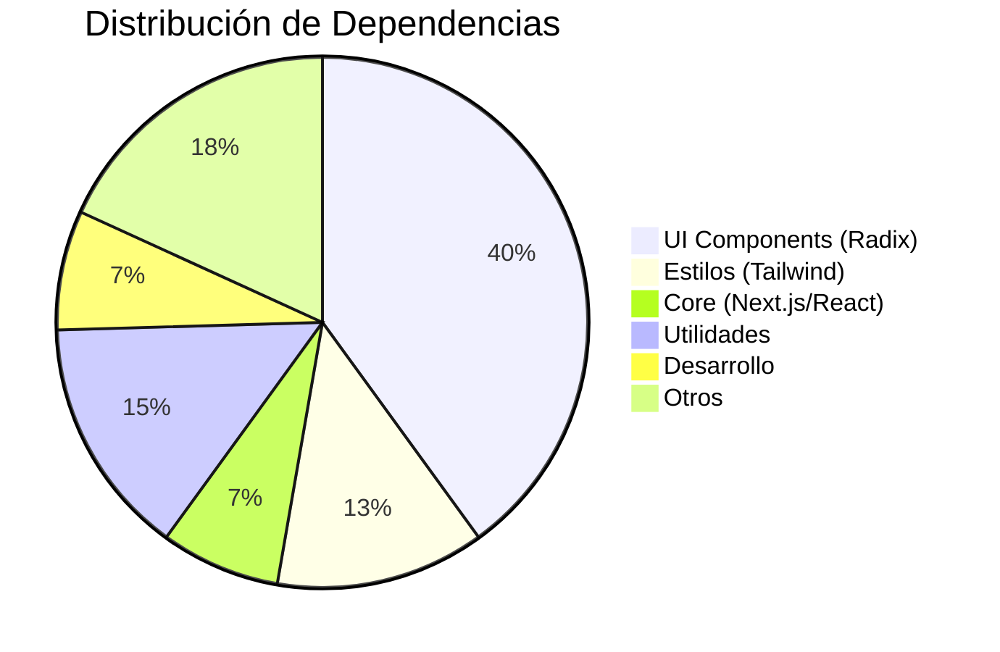

# Dependencias y Tecnologías - SwiftPDF

## 📋 Resumen Ejecutivo

Este documento detalla todas las dependencias, librerías y tecnologías utilizadas en el proyecto SwiftPDF, incluyendo sus versiones, propósitos y consideraciones de compatibilidad.

## 🏗️ Stack Tecnológico Principal

### Framework Base
| Tecnología | Versión | Propósito | Criticidad |
|------------|---------|-----------|------------|
| **Next.js** | 13.5.1 | Framework React con SSR/SSG | 🔴 Crítica |
| **React** | 18.2.0 | Librería de interfaz de usuario | 🔴 Crítica |
| **TypeScript** | 5.2.2 | Tipado estático para JavaScript | 🟡 Alta |
| **Node.js** | 16.x+ | Runtime de JavaScript | 🔴 Crítica |

## 📦 Dependencias de Producción

### Core Framework (Next.js & React)
```json
{
  "next": "13.5.1",
  "react": "18.2.0",
  "react-dom": "18.2.0",
  "@next/swc-wasm-nodejs": "13.5.1"
}
```

**Propósito:** Base del framework de la aplicación
**Notas:** Versión estable de Next.js 13 con App Router

### Componentes UI y Diseño
```json
{
  "@radix-ui/react-accordion": "^1.2.0",
  "@radix-ui/react-alert-dialog": "^1.1.1",
  "@radix-ui/react-aspect-ratio": "^1.1.0",
  "@radix-ui/react-avatar": "^1.1.0",
  "@radix-ui/react-checkbox": "^1.1.1",
  "@radix-ui/react-collapsible": "^1.1.0",
  "@radix-ui/react-context-menu": "^2.2.1",
  "@radix-ui/react-dialog": "^1.1.1",
  "@radix-ui/react-dropdown-menu": "^2.1.1",
  "@radix-ui/react-hover-card": "^1.1.1",
  "@radix-ui/react-label": "^2.1.0",
  "@radix-ui/react-menubar": "^1.1.1",
  "@radix-ui/react-navigation-menu": "^1.2.0",
  "@radix-ui/react-popover": "^1.1.1",
  "@radix-ui/react-progress": "^1.1.0",
  "@radix-ui/react-radio-group": "^1.2.0",
  "@radix-ui/react-scroll-area": "^1.1.0",
  "@radix-ui/react-select": "^2.1.1",
  "@radix-ui/react-separator": "^1.1.0",
  "@radix-ui/react-slider": "^1.2.0",
  "@radix-ui/react-slot": "^1.1.0",
  "@radix-ui/react-switch": "^1.1.0",
  "@radix-ui/react-tabs": "^1.1.0",
  "@radix-ui/react-toast": "^1.2.1",
  "@radix-ui/react-toggle": "^1.1.0",
  "@radix-ui/react-toggle-group": "^1.1.0",
  "@radix-ui/react-tooltip": "^1.1.2"
}
```

**Propósito:** Componentes UI accesibles y sin estilos
**Ventajas:**
- ✅ Accesibilidad completa (ARIA)
- ✅ Personalización total con CSS
- ✅ Compatibilidad con screen readers
- ✅ Soporte para teclado

### Estilos y CSS
```json
{
  "tailwindcss": "3.3.3",
  "tailwindcss-animate": "^1.0.7",
  "tailwind-merge": "^2.5.2",
  "class-variance-authority": "^0.7.0",
  "clsx": "^2.1.1",
  "autoprefixer": "10.4.15",
  "postcss": "8.4.30"
}
```

**Propósito:** Sistema de diseño y estilos
**Características:**
- **Tailwind CSS:** Framework utility-first
- **CVA:** Variantes de componentes tipadas
- **clsx:** Concatenación condicional de clases
- **PostCSS:** Procesamiento de CSS

### Iconografía
```json
{
  "@heroicons/react": "^2.2.0",
  "lucide-react": "^0.446.0"
}
```

**Propósito:** Iconos SVG optimizados
- **Heroicons:** Iconos principales de la interfaz
- **Lucide:** Iconos adicionales y específicos

### Animaciones
```json
{
  "framer-motion": "^12.23.12"
}
```

**Propósito:** Animaciones fluidas y transiciones
**Características:**
- ✅ Animaciones declarativas
- ✅ Gestos y drag & drop
- ✅ Optimización de rendimiento

### Internacionalización (i18n)
```json
{
  "next-i18next": "^15.4.2",
  "react-i18next": "^15.6.1"
}
```

**Propósito:** Soporte multiidioma
**Idiomas soportados:**
- 🇪🇸 Español (por defecto)
- 🇬🇧 Inglés

### Procesamiento de Archivos
```json
{
  "pdf-lib": "^1.17.1",
  "react-dropzone": "^14.3.8"
}
```

**Propósito:** Manipulación de PDFs y carga de archivos
- **pdf-lib:** Creación y edición de PDFs
- **react-dropzone:** Drag & drop de archivos

### Formularios y Validación
```json
{
  "react-hook-form": "^7.53.0",
  "@hookform/resolvers": "^3.9.0",
  "zod": "^3.23.8"
}
```

**Propósito:** Gestión de formularios y validación
- **React Hook Form:** Formularios performantes
- **Zod:** Validación de esquemas TypeScript

### Utilidades de Fecha
```json
{
  "date-fns": "^3.6.0",
  "react-day-picker": "^8.10.1"
}
```

**Propósito:** Manipulación y selección de fechas

### Componentes Adicionales
```json
{
  "cmdk": "^1.0.0",
  "embla-carousel-react": "^8.3.0",
  "input-otp": "^1.2.4",
  "react-resizable-panels": "^2.1.3",
  "recharts": "^2.12.7",
  "sonner": "^1.5.0",
  "vaul": "^0.9.9"
}
```

**Propósito:** Componentes especializados
- **cmdk:** Command palette
- **embla-carousel:** Carrusel de imágenes
- **recharts:** Gráficos y charts
- **sonner:** Notificaciones toast

### Temas
```json
{
  "next-themes": "^0.3.0"
}
```

**Propósito:** Gestión de temas claro/oscuro

## 🛠️ Dependencias de Desarrollo

### TypeScript y Tipos
```json
{
  "@types/node": "20.6.2",
  "@types/react": "18.2.22",
  "@types/react-dom": "18.2.7",
  "@types/react-pdf": "^6.2.0"
}
```

**Propósito:** Definiciones de tipos para TypeScript

### Linting y Calidad de Código
```json
{
  "eslint": "8.49.0",
  "eslint-config-next": "13.5.1"
}
```

**Propósito:** Análisis estático de código y estándares

## 🔧 Herramientas de Configuración

### Archivos de Configuración

#### [`package.json`](package.json)
```json
{
  "scripts": {
    "dev": "next dev",
    "build": "next build", 
    "start": "next start",
    "lint": "next lint"
  }
}
```

#### [`next.config.js`](next.config.js)
```javascript
const nextConfig = {
  output: 'export',
  eslint: { ignoreDuringBuilds: true },
  images: { unoptimized: true }
};
```

#### [`tailwind.config.ts`](tailwind.config.ts)
```typescript
import type { Config } from "tailwindcss"

const config: Config = {
  content: [
    './pages/**/*.{ts,tsx}',
    './components/**/*.{ts,tsx}',
    './app/**/*.{ts,tsx}',
    './src/**/*.{ts,tsx}',
  ],
  theme: {
    extend: {
      // Configuración personalizada
    }
  },
  plugins: [require("tailwindcss-animate")]
}
```

#### [`tsconfig.json`](tsconfig.json)
```json
{
  "compilerOptions": {
    "target": "es5",
    "lib": ["dom", "dom.iterable", "es6"],
    "allowJs": true,
    "skipLibCheck": true,
    "strict": true,
    "noEmit": true,
    "esModuleInterop": true,
    "module": "esnext",
    "moduleResolution": "bundler",
    "resolveJsonModule": true,
    "isolatedModules": true,
    "jsx": "preserve",
    "incremental": true,
    "plugins": [{ "name": "next" }],
    "baseUrl": ".",
    "paths": { "@/*": ["./*"] }
  }
}
```

## 📊 Análisis de Dependencias

### Distribución por Categoría


### Tamaños de Bundle (Estimados)

| Categoría | Tamaño | Porcentaje |
|-----------|--------|------------|
| **Next.js + React** | ~800KB | 32% |
| **Radix UI** | ~600KB | 24% |
| **Tailwind CSS** | ~400KB | 16% |
| **pdf-lib** | ~300KB | 12% |
| **Framer Motion** | ~200KB | 8% |
| **Otros** | ~200KB | 8% |
| **Total** | ~2.5MB | 100% |

## 🔄 Compatibilidad y Versiones

### Requisitos del Sistema
- **Node.js:** 16.x o superior (recomendado 18.x)
- **npm:** 8.x o superior
- **Navegadores:** Chrome 90+, Firefox 88+, Safari 14+, Edge 90+

### Matriz de Compatibilidad

| Dependencia | Versión Actual | Última Versión | Estado | Actualizable |
|-------------|----------------|----------------|--------|--------------|
| Next.js | 13.5.1 | 14.x | 🟡 Estable | ⚠️ Major update |
| React | 18.2.0 | 18.3.x | 🟢 Actual | ✅ Sí |
| TypeScript | 5.2.2 | 5.6.x | 🟡 Estable | ✅ Sí |
| Tailwind | 3.3.3 | 3.4.x | 🟡 Estable | ✅ Sí |
| pdf-lib | 1.17.1 | 1.17.x | 🟢 Actual | ✅ Sí |

### Dependencias Críticas
🔴 **No actualizar sin pruebas:**
- Next.js (cambios en App Router)
- React (cambios en hooks)
- Radix UI (cambios en API)

🟡 **Actualizar con precaución:**
- TypeScript (nuevas reglas)
- Tailwind CSS (cambios en clases)

🟢 **Seguro actualizar:**
- Utilidades (date-fns, clsx)
- Iconos (heroicons, lucide)

## 🚨 Vulnerabilidades y Seguridad

### Auditoría de Seguridad
```bash
# Comando para verificar vulnerabilidades
npm audit

# Comando para corregir automáticamente
npm audit fix

# Comando para forzar correcciones
npm audit fix --force
```

### Dependencias con Consideraciones de Seguridad
- **pdf-lib:** Procesamiento de archivos binarios
- **react-dropzone:** Manejo de archivos del usuario
- **next:** Configuración de seguridad CSP

### Mejores Prácticas de Seguridad
1. **Actualizar regularmente** dependencias de seguridad
2. **Revisar npm audit** antes de cada deploy
3. **Validar archivos** antes del procesamiento
4. **Limitar tamaños** de archivos subidos

## 📈 Optimizaciones de Rendimiento

### Bundle Splitting
```javascript
// next.config.js optimizations
const nextConfig = {
  experimental: {
    optimizeCss: true,
    optimizePackageImports: ['@radix-ui/react-icons']
  }
};
```

### Tree Shaking
- ✅ **Automático** con Next.js
- ✅ **Importaciones específicas** de librerías
- ✅ **Dead code elimination**

### Lazy Loading
```typescript
// Componentes lazy
const PDFViewer = dynamic(() => import('./PDFViewer'), {
  loading: () => <Skeleton />
});
```

## 🔄 Proceso de Actualización

### Actualización Segura
1. **Backup** del proyecto actual
2. **Revisar** changelog de dependencias
3. **Actualizar** dependencias menores primero
4. **Probar** funcionalidad crítica
5. **Actualizar** dependencias mayores
6. **Pruebas completas** antes de deploy

### Comandos de Actualización
```bash
# Ver dependencias desactualizadas
npm outdated

# Actualizar dependencias menores
npm update

# Actualizar dependencia específica
npm install package@latest

# Actualizar todas las dependencias (peligroso)
npm install $(npm outdated --parseable --depth=0 | cut -d: -f4)
```

## 📋 Checklist de Mantenimiento

### Mensual
- [ ] Ejecutar `npm audit`
- [ ] Revisar dependencias desactualizadas
- [ ] Actualizar dependencias de seguridad

### Trimestral
- [ ] Actualizar dependencias menores
- [ ] Revisar nuevas versiones de Next.js
- [ ] Optimizar bundle size

### Anual
- [ ] Evaluar actualización de Next.js major
- [ ] Revisar alternativas a dependencias
- [ ] Auditoría completa de rendimiento

## 📞 Recursos y Documentación

### Documentación Oficial
- **Next.js:** https://nextjs.org/docs
- **React:** https://react.dev/
- **Tailwind CSS:** https://tailwindcss.com/docs
- **Radix UI:** https://www.radix-ui.com/primitives
- **pdf-lib:** https://pdf-lib.js.org/

### Herramientas de Análisis
- **Bundle Analyzer:** `npm install --save-dev @next/bundle-analyzer`
- **Dependency Cruiser:** Para análisis de dependencias
- **npm-check-updates:** Para gestión de actualizaciones

---

**Documento creado:** 13 de Agosto, 2025  
**Versión:** 1.0  
**Próxima revisión:** Después de cada actualización mayor